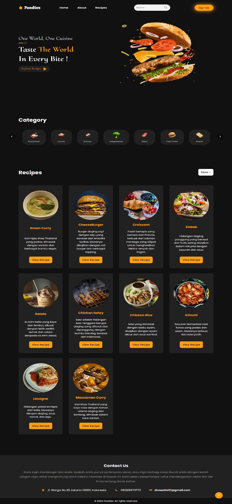
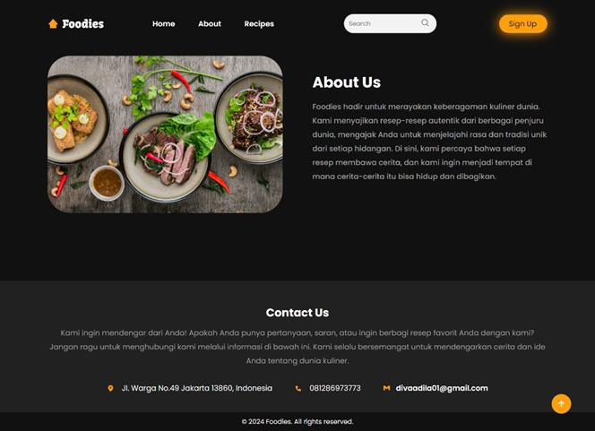
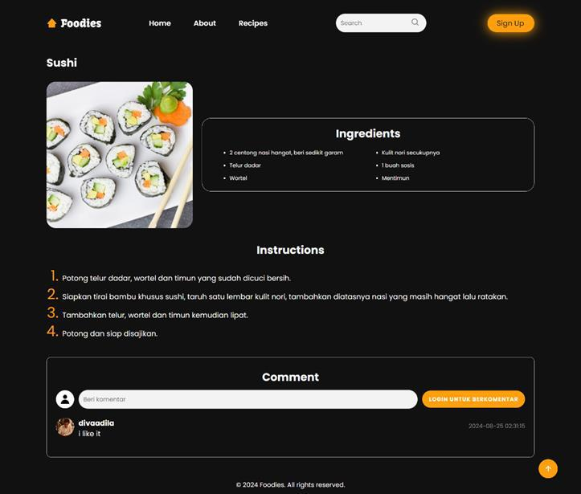
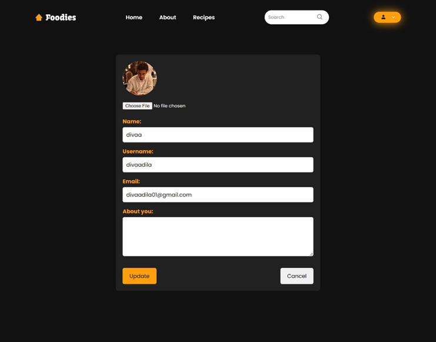
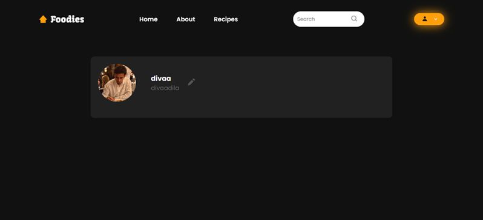
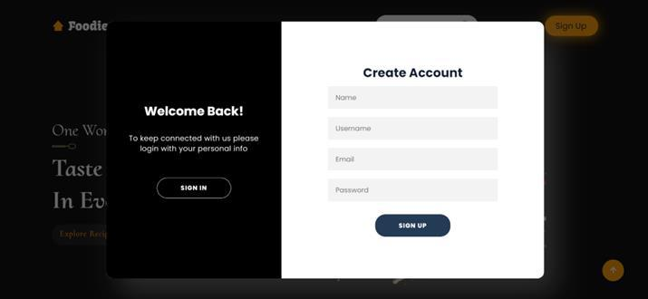
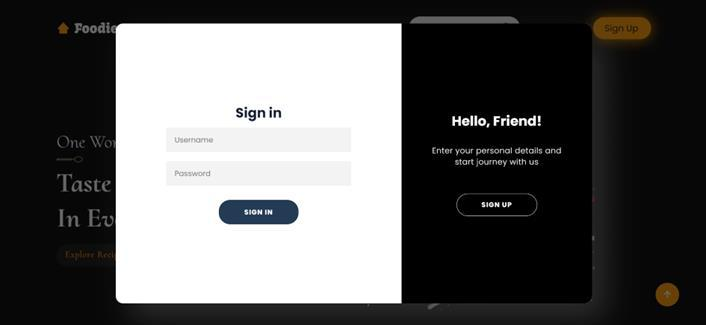
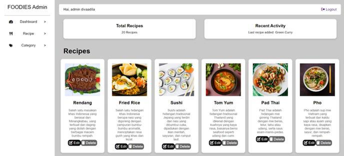

# 🍽️ Foodies — International Food Recipe Website
Foodies is an international food recipe website developed as part of an academic scientific project. This website is designed to provide users with access to a wide variety of international recipes while offering interactive features to enhance user engagement.

# 🎯 Project Purpose
The purpose of this project is to create a web-based platform that allows users to: 
* Explore international food recipes
* Interact through comments on recipes
* Manage their personal profiles easily

# ✨ Key Features
* 🔐 Login & Registration : User authentication system to access personalized features.
* 💬 Recipe Commenting : Users can leave comments on recipes.
* 👤 Edit Profile : Users can update their profile information such as profile picture, name, username, and bio.
* 🔎 Category-Based Search : Recipes can be searched and filtered based on food categories.
* 📖 International Recipe Collection : Displays a variety of recipes from different countries.

# 🛠️ Technologies Used
* HTML
* PHP
* CSS
* Javascript
* MySQL
* Figma

# 📷 Screenshots

  
  

  
  
  

  
  
  

